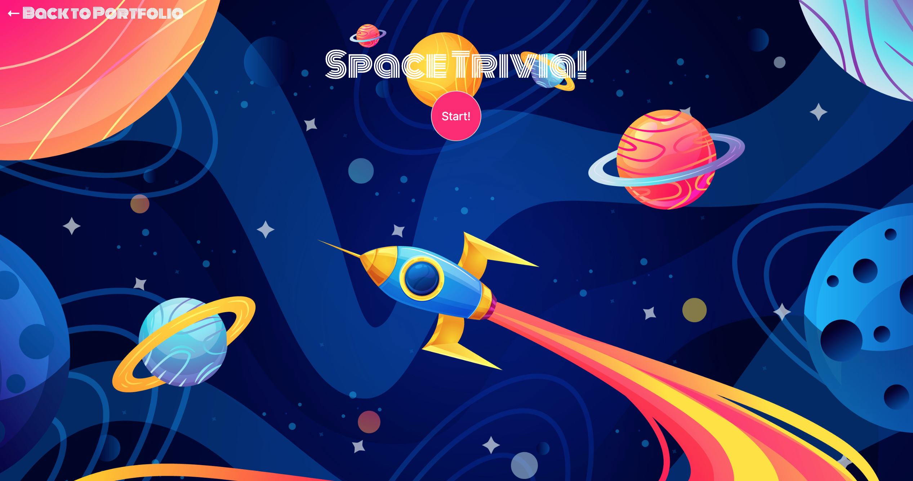
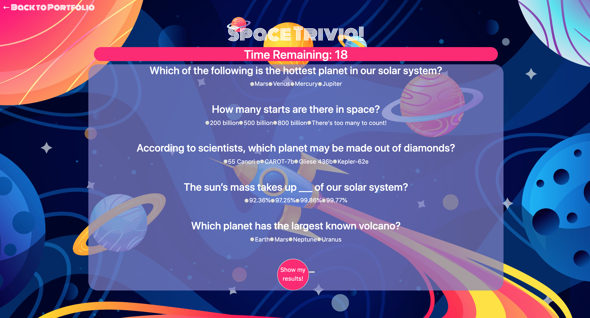
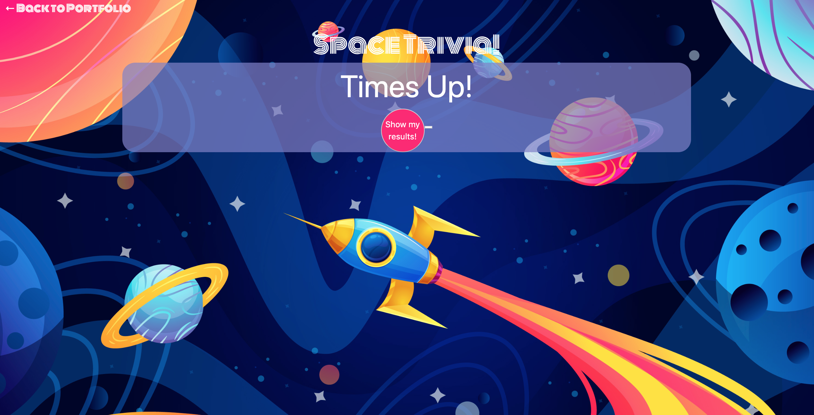
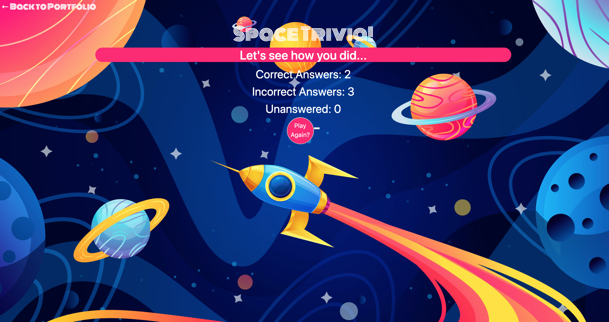

# basic-timed-trivia

### Link to Live Game: https://emily-brown.github.io/basic-timed-trivia/

## Game Objective: 
Guess 5 space themed questions in 25 seconds. 

### Game Instructions:
Begin game by clicking start to show 5 questions in 25 seconds then click "Show my results!" to see how you did.

## Tools/Lanugages Used:
```
  -- HTML/CSS
  -- JQuery
  -- Javascript 
  -- Bootstrap 
  -- Google Fonts 
```

## Game Features

##### Start Screen
```
Functionality: 
  - Begin quiz by clicking the "Start Button"
```


##### Question Screen
```
Functionality: 
  - Player will be shown 5 questions and a timer counting down from 25 seconds.
  - If the player answers all 5 questions before the 25 seconds is up, they can click "Show my results!" to see how they did.
  - If all 25 seconds is up, screen will hide all questions and display a message indicating that time is up. 
```




##### Results Screen
```
Functionality: 
  - Player will be shown their results indicating how many correct, incorrect or unanswered questions they got.
  - The player then has the option to "Play Again" 
```


### License: 
MIT License 


